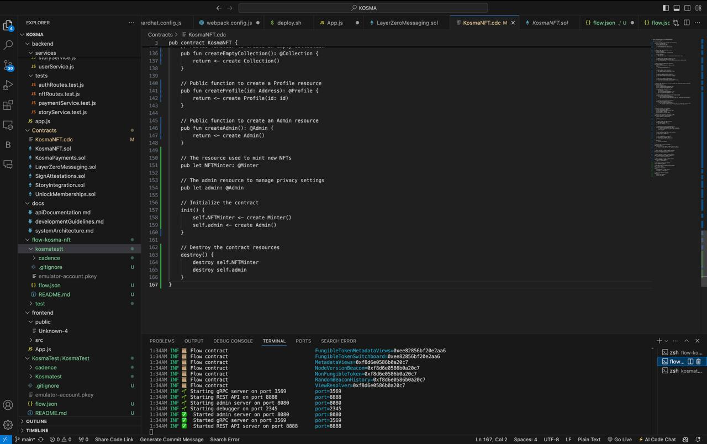
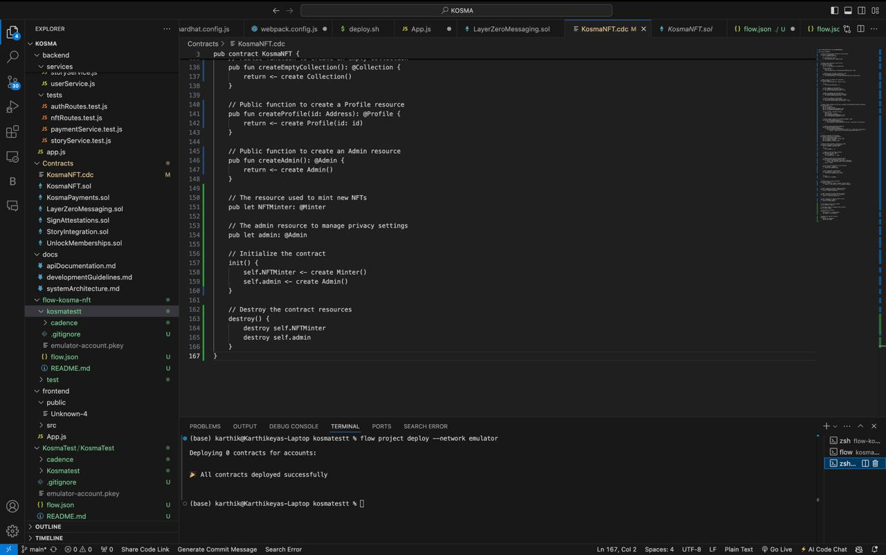
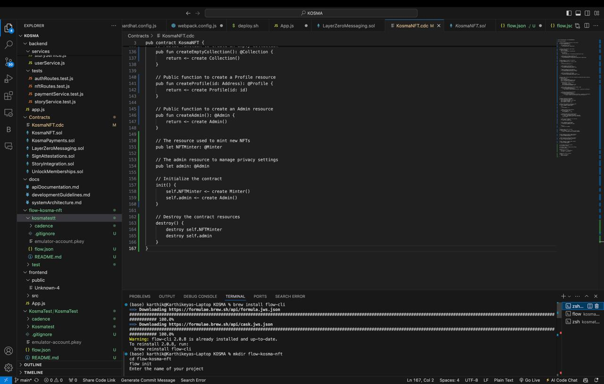

# Kosma Decentralized Social Media Platform

Kosma is a decentralized social media platform that aims to provide a secure, non-invasive, privacy-centric alternative to current social networks. By leveraging blockchain technology, Kosma gives users control over their data, content, and monetization options, while ensuring cross-chain compatibility and efficient content licensing.

## Table of Contents

- [Project Overview](#project-overview)
- [Technologies Used](#technologies-used)
- [Core Features](#core-features)
- [System Architecture](#system-architecture)
- [Frontend Modules](#frontend-modules)
- [Backend Modules](#backend-modules)
- [Smart Contracts](#smart-contracts)
- [Deployment](#deployment)
- [Installation and Setup](#installation-and-setup)
- [Usage](#usage)
- [Contribution Guidelines](#contribution-guidelines)
- [License](#license)
- [Acknowledgments](#acknowledgments)
- [Contact](#contact)

## Project Overview

Kosma aims to disrupt the current social media landscape by prioritizing user privacy, non-addictive content consumption, and transparent monetization. It enables users to securely interact, create content, mint NFTs, license their work, and communicate across different blockchain networks. The platform offers seamless cross-chain interactions and privacy-centric features by integrating multiple blockchain tools and services.

## Technologies Used

- **Solidity**: Smart contract development for NFT minting, payments, attestations, etc.
- **[Flow Blockchain](#Flow-Blockchain)**: Kosma utilizes Flow blockchain's native smart contract language, Cadence, to manage NFTs representing user-generated content. Flow is used to manage user privacy settings, enable secure content minting, and prevent unauthorized content capture.
- **[LayerZero V2](#layerzero)**: Cross-chain messaging and NFT interactions.
- **[Story Protocol](#Sign-Protocol)**: Content licensing, royalty, and dispute management. Integrates with Story Protocol SDK for issuing licenses, managing royalties, and handling disputes.
- **[Sign Protocol](#Sign-Protocol)**: Attestations for content ownership, licensing, and user verification. Integrates with the Sign Protocol SDK to create, manage, and verify attestations for IP.
- **Superfluid**: Streaming payments for subscriptions and royalty payments.
- **[Circle USDC](#Circle)**: Stablecoin payments and cross-chain transfers using Circle's CCTP.
- **[LedgerJS](#ledger)**: Integration for secure wallet connections and user authentication with Ledger hardware wallets.
- **XMTP**: Secure on-chain messaging for comments and notifications.
- **Unlock Protocol**: Membership management for premium content.
- **React.js**: Frontend UI components.
- **Node.js/Express**: Backend APIs to interact with the blockchain.
- **MongoDB**: Metadata storage and user management.t 

## Core Features

- **NFT Minting and Royalty Management**: Users can mint NFTs representing their content and specify royalty percentages.
- **Content Licensing**: Implemented via Story Protocol, enabling secure and clear licensing agreements.
- **Membership and Exclusive Content**: Managed through Unlock Protocol, offering multiple membership tiers.
- **Streaming Payments**: Leveraging Superfluid for continuous payments for licensed content.
- **Cross-Chain Compatibility**: LayerZero V2 for transferring NFTs and messages across blockchain networks.
- **Secure Messaging and Encryption**: Using XMTP and Lit Protocol for encrypted notifications and secure messaging.
- **AI-Powered Content Generation**: AI tools integrated for generating captions, text, and other creative content.

## System Architecture

The platform is divided into the following major components:

- **Smart Contracts**: Written in Solidity, these handle NFT minting, licensing, attestations, royalty distribution, and payments.
- **Backend Services**: A Node.js/Express server that handles API requests, blockchain interactions, and database management.
- **Frontend Application**: A React.js application for user interactions, content consumption, and wallet integration.
- **Database**: MongoDB used for storing metadata about users, content, transactions, and profiles.

For detailed system architecture, refer to the documentation available in the `/docs/systemArchitecture.md` file.

## Frontend Modules

### Components

- **Navbar.js**: Main navigation menu, integrates with LedgerJS for wallet connections.
- **ContentCard.js**: Displays user-generated content, including options for liking, sharing, and licensing.
- **MembershipCard.js**: Shows membership details and allows users to purchase memberships via Unlock Protocol.
- **PaymentForm.js**: Manages all payments, including tips, content purchases, and streaming subscriptions.
- **LedgerConnect.js**: Facilitates connecting to the Ledger wallet for transactions.

### Pages

- **HomePage.js**: Displays trending content, user engagement, and recommended creators.
- **ProfilePage.js**: Provides an overview of a user's content, NFTs, and memberships.
- **ContentPage.js**: Shows detailed content view, including licensing options and cross-chain interactions.

## Backend Modules

- **app.js**: Main backend server, runs using Node.js/Express.
- **routes/**: Includes different API endpoints for handling user authentication, NFT minting, payments, attestations, etc.
- **services/**: Connects the backend to the blockchain for operations such as payments, attestations, and cross-chain messaging.
- **middlewares/**: Security and verification middleware for handling user authentication and blockchain interactions.

## Smart Contracts

- **KosmaNFT.sol**: Handles NFT minting, royalty distribution, and licensing management.
- **LayerZeroMessaging.sol**: Facilitates cross-chain messaging using LayerZero V2.
- **SignAttestations.sol**: Uses Sign Protocol to manage attestations for ownership, licensing, and verification.
- **StoryIntegration.sol**: Manages content licensing, royalties, and disputes using Story Protocol.
- **KosmaPayments.sol**: Handles payments using Circle USDC and Superfluid for streaming.
- **UnlockMemberships.sol**: Manages memberships for premium content using Unlock Protocol.

## Deployment

### Contracts Deployment:
Smart contracts are deployed using **Truffle** or **Hardhat**.

### Frontend Deployment:
The frontend is deployed to a hosting service using `deployFrontend.sh`.

### Subgraph Creation:
Use `/scripts/createSubgraph.js` to create a subgraph for indexing data using **The Graph**.

## Installation and Setup

1. **Clone the Repository:**
   ```bash
   git clone https://github.com/yourusername/kosma.git
   cd kosma
   ```
2. **Install Dependencies:**
   ```bash
   npm install
   ```
3. **Environment Configuration**: Copy `.env.example` to `.env` and fill in the necessary credentials and blockchain keys.
4. **Start Backend Server:**
   ```bash
   npm run start-backend
   ```
5. **Start Frontend Application:**
   ```bash
   npm run start-frontend
   ```
6. **Deploy Smart Contracts:** Follow the steps in `/docs/deploymentGuide.md` to deploy contracts.

## Usage
1. **Connect Wallet**: Connect your Ledger wallet using the Navbar.
2. **Mint NFTs**: Use the profile page to create NFTs for your content.
3. **License Content**: View and set licensing terms on the content page.
4. **Join Memberships**: Purchase memberships using Unlock Protocol to access exclusive content.

## Contribution Guidelines
We welcome contributions to Kosma! Please follow these steps:

1. **Fork the Repository**: Fork and clone the repository to your local machine.
2. **Create a Feature Branch**: Create a branch for your feature or bug fix.
3. **Commit Your Changes**: Make sure to add detailed commit messages.
4. **Push to Your Branch**: Push your branch to your fork.
5. **Open a Pull Request**: Open a pull request against the main repository.

For detailed contribution guidelines, see `/docs/developmentGuidelines.md`.

## License

Kosma is licensed under the MIT License. See the [LICENSE](LICENSE) file for more information.

## Acknowledgments

- We would like to thank the developers and contributors of the libraries and protocols used in this project.
- Special thanks to the open-source community for their continuous support and contributions.

## Contact

For any inquiries or feedback, please reach out to us at [gummadikarthikeya3@gmail.com](mailto:gummadikarthikeya3@gmail.com).

KOSMA team Social Handles.

[Karthikeya Gummadi](https://www.linkedin.com/in/karthikeya9296/) - linkdIn
- [gummadikarthikeya3@gmail.com](mailto:gummadikarthikeya3@gmail.com)

[Sannith Reddy Gunreddy](https://www.linkedin.com/in/sannith-reddy/)  - linkdIn
- [sannithgunreddy@gmail.com](mailto:sannithgunreddy@gmail.com)

[Sai Shreya Suryavamshi](https://www.linkedin.com/in/suryavamshi-sai-shreya-b760801bb/)   - linkdIn
- [suryavamshisaishreya3007@gmail.com](mailto:suryavamshisaishreya3007@gmail.com)

[Srinith Rao Bichinepally](https://www.linkedin.com/in/srinith-ab0848241/)  - linkdIn
- [srinithraobichinepally14141@gmail.com](mailto:srinithraobichinepally14141@gmail.com)

[Aravind Sai Srinivas Boddeti](https://www.linkedin.com/in/aravind007) - linkdIn
- [aravindsai1050@gmail.com](mailto:aravindsai1050@gmail.com)

---

### Additional ReadMe Files for Integrated Tools

#### Flow Blockchain 
- (Most Killer App Potential & Best Sports App)
- Contracts:
- [KosmaNFT.cdc](Contracts/KosmaNFT.cdc)  - Manages NFTs on Flow, using Cadence smart contracts.
- Backend:
- [nftService.js](backend/services/nftService.js) - Manages Flow NFTs.
- Frontend:
- Components/Pages:
- [ContentPage.js](frontend/src/pages/ContentPage.js) - Uses Flow to mint NFTs and interact with Flow content.
- [HomePage.j](frontend/src/pages/HomePage.js) - Displays sports-related content using Flow Blockchain.
- [ProfilePage.js](frontend/src/pages/ProfilePage.js) - Displays user-owned NFTs on Flow.
- [Demo](https://drive.google.com/file/d/1wDwe8xneUsPF1jXXFNhB0oVUfBRcyNmJ/view?usp=sharing)




#### LayerZero 
- (Most Innovative Omnichain Solution)
- Contracts:
- [LayerZeroMessaging.sol](Contracts/LayerZeroMessaging.sol) - Handles omnichain communication using LayerZero V2.
- Backend:
- [omnichainService.js](backend/services/omnichainService.js) - Provides endpoints for LayerZero cross-chain communication.
- [omnichainRoutes.js](backend/routes/omnichainRoutes.js) - Routes for cross-chain messaging.
- Frontend:
- Components/Pages:
- [ContentPage.js](frontend/src/pages/ContentPage.js) - Allows cross-chain content interactions using LayerZero.
- [ProfilePage.js](frontend/src/pages/ProfilePage.js) - Integrates with LayerZero for cross-chain NFT transfers.
- [Demo](https://drive.google.com/file/d/1c4LKV0fKxETour6R0XrHC5gVxEz21E1S/view?usp=sharing)

#### Sign Protocol 
- (Best Overall Application & Encrypted Attestations)
- Contracts:
- [SignAttestations.sol](Contracts/SignAttestations.sol) - Manages attestations for content ownership, licensing, and user verification using Sign Protocol.
- Backend:
- [attestService.js](backend/services/attestService.js) - Handles attestations related to content ownership, licensing, and identity.
- [attestRoutes.js](backend/routes/attestRoutes.js) - Routes for attestation management.
- Frontend:
- Components:
- [ContentCard.js](frontend/src/components/ContentCard.js) - Uses Sign Protocol for verifying likes as attestations.
- [MembershipCard.js](frontend/src/components/MembershipCard.js) - Uses Sign Protocol to verify memberships.
- ProfilePage.js - Users can manage attestations and verify their content ownership.
- [Demo](https://drive.google.com/file/d/1qVrRaLwt8WEMWC0Utqqrv_UY3V2_ZAoT/view?usp=sharing)

#### Story Protocol 
- (Best Overall Use of the Proof of Creativity Protocol & Best AI Application on Story)
- Contracts:
- [StoryIntegration.sol](Contracts/StoryIntegration.sol) - Manages content licensing, royalties, and disputes using Story Protocol.
- Backend:
- [storyService.js](backend/services/storyService.js) - Provides endpoints to create licenses, manage royalties, and handle disputes.
- [storyRoutes.js](backend/routes/storyRoutes.js) - Routes for licensing, royalty, and dispute management.
- Frontend:
- Components/Pages:
- [RoyaltyDashboard.js](frontend/src/pages/RoyaltyDashboard.js) - Manages royalties using Story Protocol.
- [ContentPage.js](frontend/src/pages/ContentPage.js) - Enables licensing of content using Story Protocol.
- [ProfilePage.js](frontend/src/pages/ProfilePage.js) - Manages royalties and licensing using Story Protocol.
- [AIContentGenerator.js](frontend/src/components/AIContentGenerator.js) - Allows AI-generated content registration using Story Protocol.
- [Demo](https://drive.google.com/file/d/1ZWcKYeUsdNnVV6Em5khipbTsMfYEOW_H/view?usp=sharing)

#### Circle 
- (USDC Integration Prize & Cross-Chain Transfers)
- Contracts:
- [KosmaPayments.sol](Contracts/KosmaPayments.sol) - Manages payments using Circle USDC, including cross-chain transfers using Circle's CCTP.
- Backend:
- [paymentService.js](backend/services/paymentService.js) - Manages USDC payments, conversions, and streaming payments using Superfluid.
- [paymentRoutes.js](backend/routes/paymentRoutes.js) - Routes for handling Circle USDC payments.
- Frontend:
- Components:
- [PaymentForm.js](frontend/src/components/PaymentForm.js) - Allows users to make payments using Circle USDC.
- [HomePage.js](frontend/src/pages/HomePage.js) - Allows content monetization using Circle USDC for tipping.
- [Demo](https://drive.google.com/file/d/1t4GqRY3-3yVbpK3pq6DgZNQPKCt0okXT/view?usp=sharing)

#### Ledger 
- (Best Use of Ledger Technology)
- Frontend:
- Components:
- [LedgerConnect.js](frontend/src/components/LedgerConnect.js) - Integrates Ledger hardware wallet for secure transactions.
- [Navbar.js](frontend/src/components/navbar.js) - Allows users to connect their Ledger wallet for secure interactions.
- [ProfilePage.js](frontend/src/pages/ProfilePage.js) - Provides an easy interface for Ledger wallet integration and managing NFTs securely.
- [Demo](https://drive.google.com/file/d/13vDAMm-qyPVFtT0oieoIvcbRey-qeU3D/view?usp=sharing)